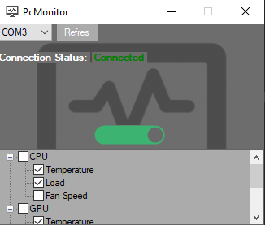
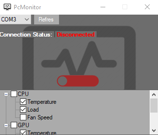
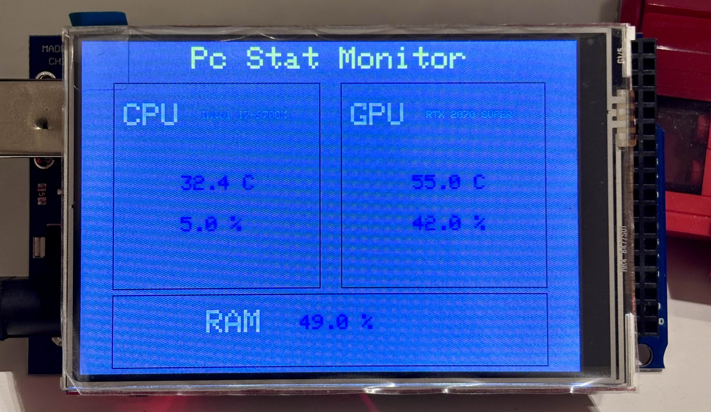
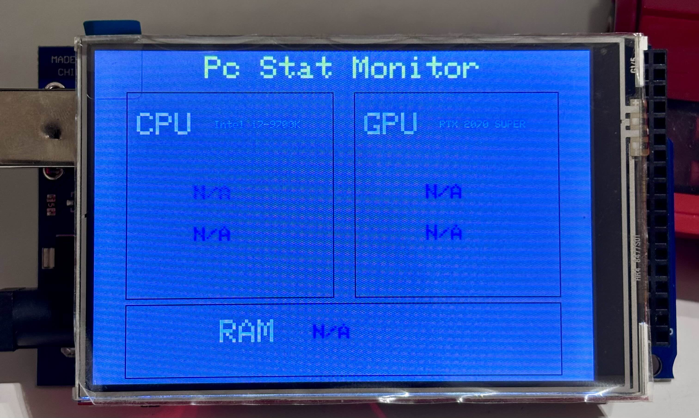

# PC Stat Monitor 

**PC stat Monitor** is a DIY mini-project designed to monitor your PC's hardware stats (CPU, GPU, RAM) in real-time. The app communicates with an Arduino to display the stats on an external TFT screen, which goes into sleep mode (black screen) when communication is turned off. 

Additionally, the app ensures that only one instance can run at a time, preventing multiple app windows from interfering when communication is active.

This project uses the [LibreHardwareMonitor](https://github.com/LibreHardwareMonitor/LibreHardwareMonitor) library to gather hardware information.

---

## Features
- **Real-time Monitoring**: Monitor CPU temperature, CPU load, GPU temperature, GPU load, and RAM usage.
- **Arduino Integration**: Communicates with an Arduino via the COM port to display stats on a TFT screen.
- **System Tray Functionality**: Runs in the system tray with toggle functionality.
- **Customizable Ports and Stats**: Select the COM port and stats to send via the interface.

---

## Installation
To install the application, follow these steps:
1. **Download the installer** from the [latest release](https://github.com/Faisal-Baj/Pc-Monitor-Stat/releases/latest).
2. Run the `setup.exe` or `PcMonitorSetup.msi` file and follow the installation instructions.
3. Launch the application from the Start Menu or desktop shortcut.

---

## Arduino Code
The installer only provides the communication part of the project. You will need to upload the Arduino code to your board to display the data.

You can find the Arduino code [here](https://github.com/Faisal-Baj/Pc-Monitor-Stat/tree/V1.0/Arduino-Pc-Monitor).

---

## How to Use
1. Open the application and select the COM port connected to your Arduino.
2. Toggle the communication ON/OFF using the toggle button.
3. View your PC stats on your Arduino's display.

---

## Screenshots
 

---

## Credits
- **[LibreHardwareMonitor](https://github.com/LibreHardwareMonitor/LibreHardwareMonitor)**: Used for collecting hardware stats.
- Special thanks to the open-source community for making this project possible.
